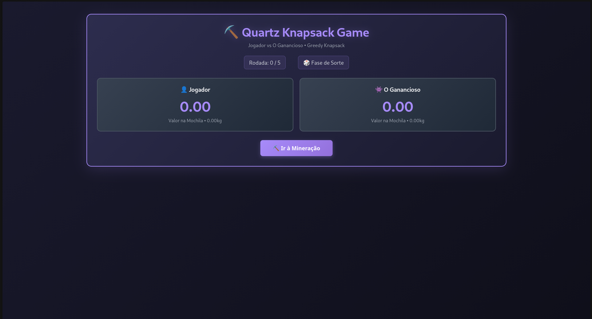
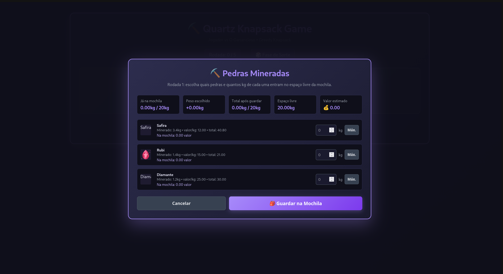
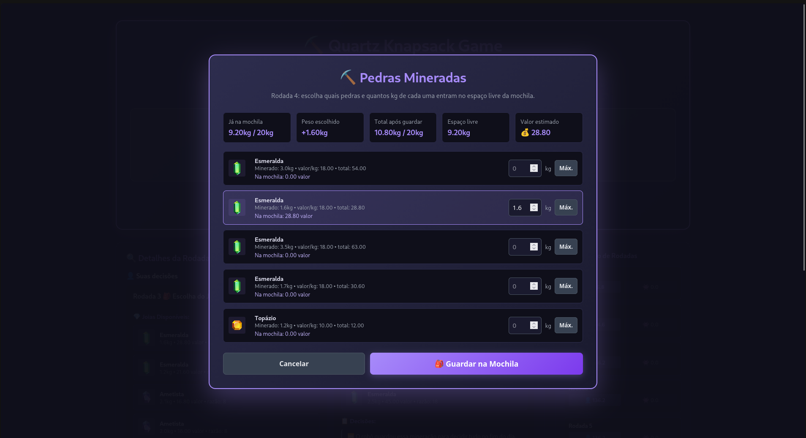
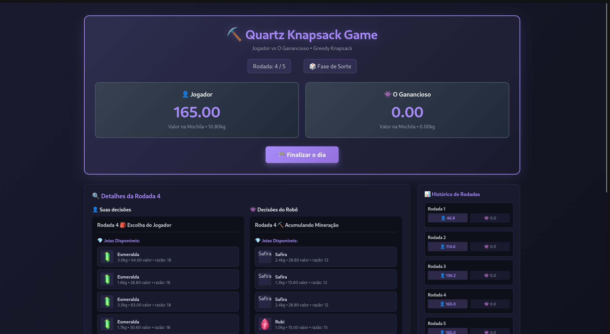
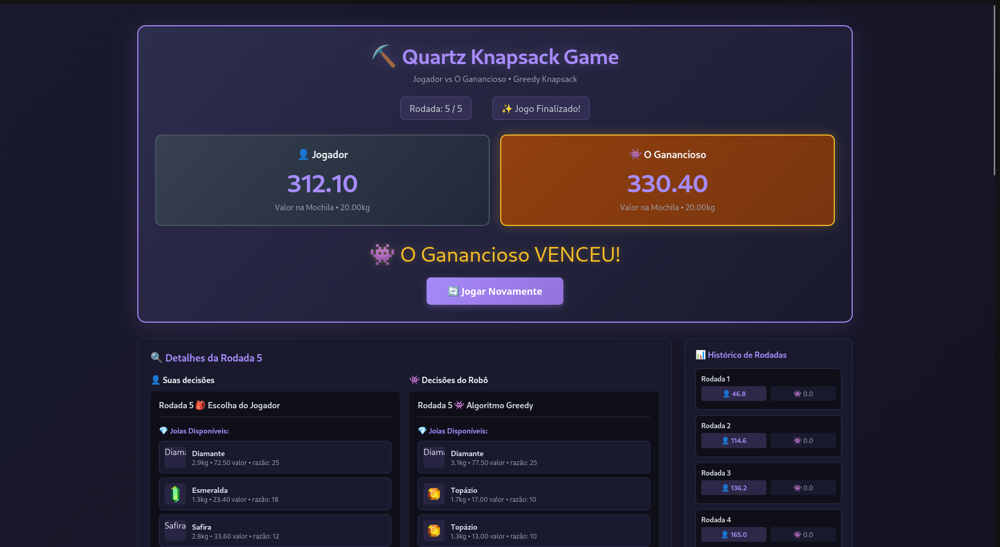

# Quartz Knapsack Game - Algoritmo Guloso

Grupo: 32<br>
Conteúdo da Disciplina: Projeto de Algoritmo<br>

## Vídeo de apresentação

<iframe width="1676" height="943" src="https://www.youtube.com/embed/L4l1FKB3GFE" title="Apresentacao trabalho 2 de PA" frameborder="0" allow="accelerometer; autoplay; clipboard-write; encrypted-media; gyroscope; picture-in-picture; web-share" referrerpolicy="strict-origin-when-cross-origin" allowfullscreen></iframe>

## Alunos

| Matrícula  | Aluno                  |
| ---------- | ---------------------- |
| 21/1061565 | Daniel Ferreira Nunes  |
| 21/1061707 | Felipe de Sousa Coelho |

## Sobre

Projeto de visualização interativa do algoritmo **Greedy Knapsack** (Mochila Gulosa) através de um jogo competitivo inspirado em Quartz.

Atualmente o sistema permite:

- **Jogo Competitivo**: Jogador vs O ganancioso (Computador)
- **5 Rodadas de Mineração**: Cada jogador minera até 5 vezes
- **Estratégia Progressiva**: Sorte nas 4 primeiras rodadas, Algoritmo Greedy na 5ª rodada
- **Knapsack Fracionário**: Joias podem ser fracionadas para otimizar o espaço
- **Capacidade de 20kg**: Limite de peso da mochila
- **Joias com Densidades Variadas**: Diamante, Esmeralda, Rubi, Safira e Topázio
- **Interface Visual Intuitiva**: Tema de mineração com feedback em tempo real
- **Comparação de Estratégias**: Demonstra a diferença entre sorte e algoritmo ótimo

## Screenshots

# Imagem 1 - Tela inicial do jogo:



# Imagem 2 - Escolha de itens durante a mineração:






# Imagem 3 - Depois de escolher os itens, mostrando a mochila preenchida e o placar:



# Imagem 4 - Tela final mostrando o resultado do jogo:



## Instalação

Linguagens: JavaScript, HTML, CSS  

Framework: React

```bash
npm install
npm run dev
```

Acesse `http://localhost:5173` no navegador.

## Uso

1. Clique em **"⛏️ Ir à Mineração"** para começar uma rodada.
2. A escolha de itens alternará entre o Jogador e O ganancioso (Computador).
3. **Rodadas 1-4**: Os itens são escolhidos aleatoriamente (60% de chance cada).
4. **Rodada 5**: O ganancioso usa o Algoritmo Greedy para otimizar sua mochila.
5. Acompanhe o valor total e o peso da mochila em tempo real.
6. Ao final de 5 rodadas de cada jogador, o jogo termina automaticamente.
7. Veja os resultados finais e compare as estratégias utilizadas.
8. Clique em **"Novo Jogo"** para recomeçar.
